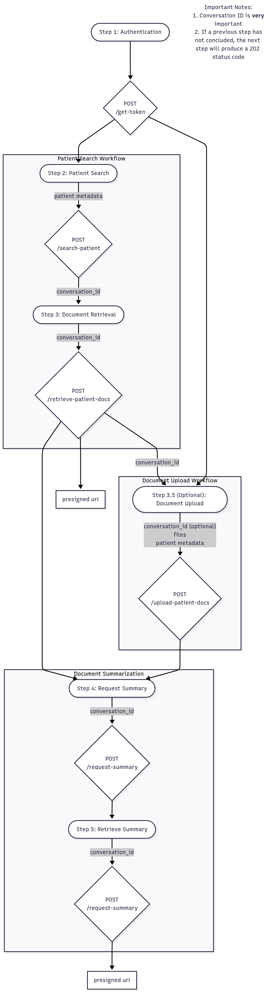

# Abstractive Health Public Scripts

This repository contains example scripts and tutorials for integrating with the Abstractive Health API. The API provides powerful capabilities for medical document retrieval, processing, and summarization through the Carequality® network.

## API Workflow Overview

The workflow consists of several key steps:

### Step 1: Authentication 🔑
- Obtain access token for API interactions
- Required for all subsequent API calls

### Step 2: Data Aggregation 📊
You can aggregate patient data through three methods:

1. **Patient Search** 🔍
   - Search the Carequality® network using patient demographics
   - Retrieve clinical documents from connected healthcare providers

2. **Document Upload** 📤
   - Submit your own documents (CDA, FHIR, PDFs, images)
   - Process documents you already have

3. **Hybrid Approach** 🔄
   - First search for patient records in the network
   - Then add your own documents to the same conversation
   - Combine network-retrieved and uploaded documents

### Step 3: Summarization 🧠
- Request AI-generated clinical summaries from aggregated documents
- Retrieve structured JSON output containing:
  - Patient history and presenting illness (HPI)
  - Lab results and imaging studies
  - Vital signs
  - Allergies
  - Family and social history
  - Past clinical events
  - Historical followups
  - Provider information
  - Medication history

### Step 4: Push Medical Document 📝
- Submit updated treatment notes back to the network
- Fulfill HIE reciprocity requirements
- Contribute to comprehensive patient health records

## Getting Started

1. Check out the `api_tutorial.ipynb` notebook for a complete walkthrough
2. Replace placeholder credentials with your API access details
3. Follow the step-by-step examples for each workflow component

## Important Notes

1. Conversation ID is very important for tracking document processing
2. If a previous step has not concluded, the next step will produce a 202 status code
3. Always handle both synchronous (200) and asynchronous (202) response codes
4. Use appropriate error handling and retries for robust integration

## Support

For questions or support with API integration, please contact Abstractive Health support.